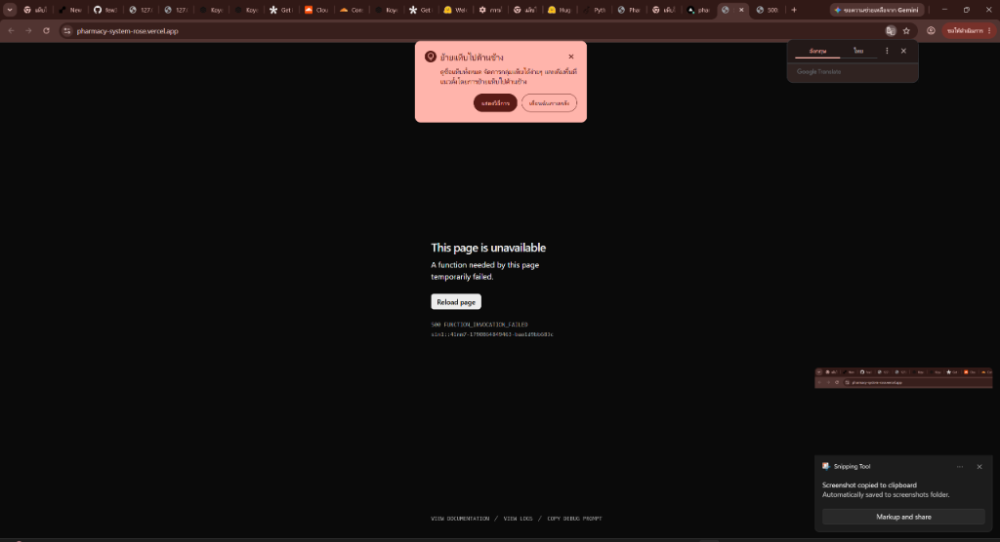
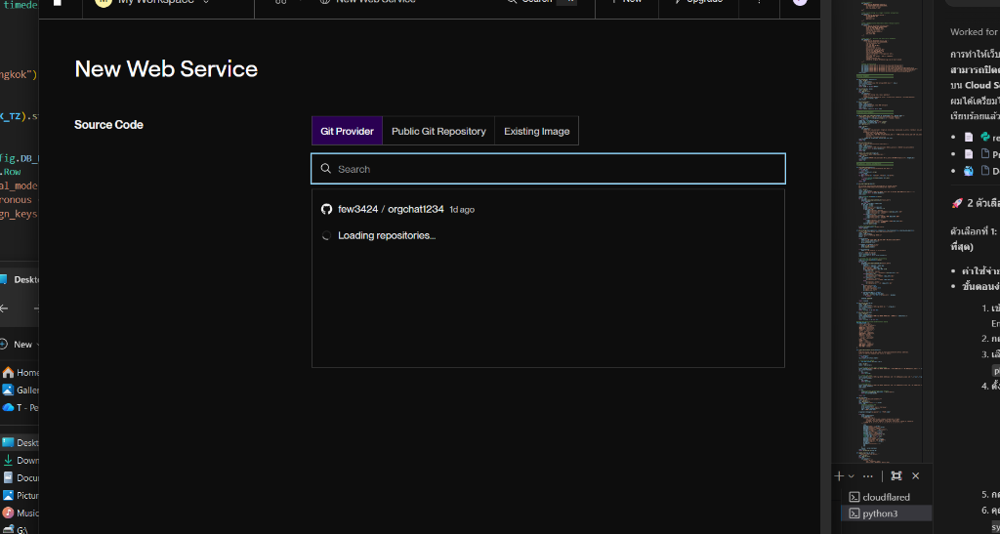
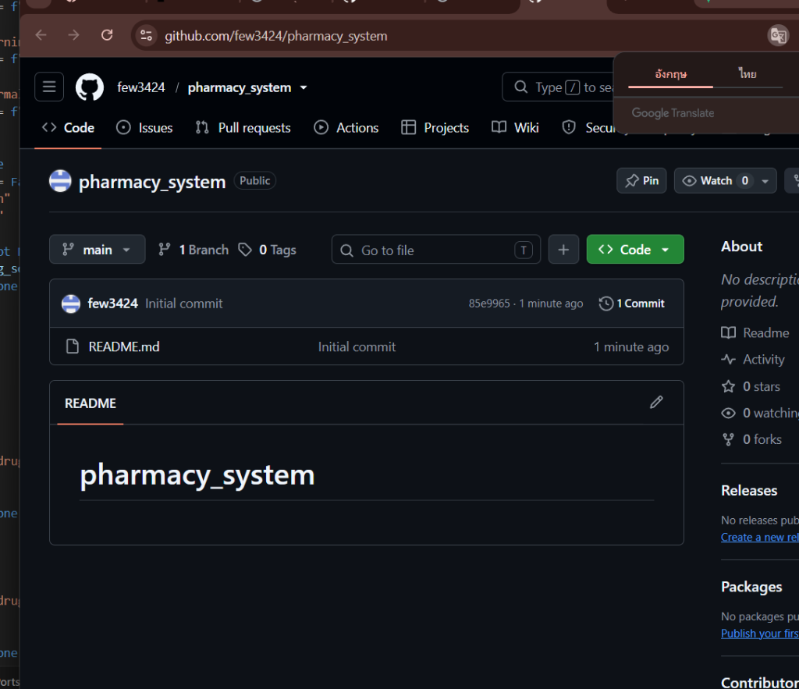
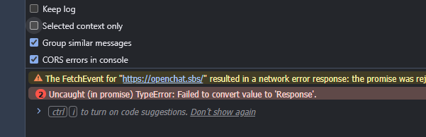

<div align="center">

# 🏥 PharmaCore RX-OS
### Intelligent Pharmacy Stock Management & Clinical Dispensing Platform
**ระบบบริหารจัดการคลังยาและการตัดสต็อกอัจฉริยะสำหรับคลินิกและร้านขายยา**

[](https://www.python.org/)
[](https://flask.palletsprojects.com/)
[](https://www.sqlite.org/)
[](https://developers.line.biz/)
[](https://workspace.google.com/)
[](LICENSE)

<br/>



<br/><br/>

[**🇹🇭 ภาษาไทย (Thai)**](#-ภาษาไทย-thai-version) • [**🇬🇧 English Version**](#-english-version)

---

</div>

## 🇹🇭 ภาษาไทย (Thai Version)

### 📌 ภาพรวมโปรเจกต์ (Project Overview)
**PharmaCore RX-OS** เป็นระบบจัดการคลังยา จ่ายยา และตัดสต็อกอัตโนมัติ ออกแบบมาเพื่อยกระดับความแม่นยำและความเร็วของงานเภสัชกรรมในคลินิก สถานพยาบาล และร้านขายยา ลดข้อผิดพลาดในการจ่ายยา (Zero Human Error) ผสานการทำงานร่วมกับ **QR/Barcode Scanning, แจ้งเตือน LINE อัตโนมัติ, ซิงค์ข้อมูลสองทางกับ Google Sheets/Drive, เครื่องพิมพ์สติ๊กเกอร์ยาแบบกำหนดขนาดได้เอง และ PWA สำหรับใช้งานบนมือถือ**

---

### 📸 ภาพหน้าจอการทำงานจริง (Screenshots & System Walkthrough)

<table align="center" width="100%">
  <tr>
    <td width="50%" align="center">
      <b>🖨️ หน้าต่างตั้งค่าการพิมพ์สติ๊กเกอร์ยา (Custom Label Engine)</b><br/><br/>
      
      <p align="left"><i>รองรับการพิมพ์ทั้งแบบเดี่ยวและแบบชุด (Batch Print), เลือกขนาดกระดาษ A4 / สติ๊กเกอร์ม้วนความร้อน (Thermal), ปรับจำนวนคอลัมน์ได้สูงสุด 12 คอลัมน์</i></p>
    </td>
    <td width="50%" align="center">
      <b>📄 ตัวอย่างการพิมพ์สติ๊กเกอร์จริง (Print Preview)</b><br/><br/>
      
      <p align="left"><i>ระบบ Dynamic Grid 100% จัดวางเต็มหน้ากระดาษ ไร้ขอบว่างด้านขวา พร้อม QR Code ความละเอียดสูงและชื่อยา/ล็อต/วันหมดอายุ</i></p>
    </td>
  </tr>
  <tr>
    <td colspan="2" align="center">
      <b>📱 ระบบสแกนเนอร์จ่ายยาผ่านกล้องมือถือ/แท็บเล็ต (Mobile Barcode & QR Scanner)</b><br/><br/>
      
      <p align="center"><i>สแกนบาร์โค้ดหรือคิวอาร์โค้ดยาเพื่อดูรายละเอียดและตัดสต็อกได้ทันทีผ่านกล้องอุปกรณ์ทุกรุ่น</i></p>
    </td>
  </tr>
</table>

---

### ✨ ฟีเจอร์เด่นของระบบ (Core Features)

1. **📦 การจัดการคลังยาและคุมล็อต (Master Inventory & Lot Management)**
   - บันทึกชื่อการค้า, ชื่อสามัญทางยา (Generic Name), รหัสยา/บาร์โค้ด, หมวดหมู่, รูปแบบยา, รูปภาพ, ตำแหน่งเก็บในตู้ยา, และจุดเตือนขั้นต่ำ
   - ระบบ **รับยาเข้าคลัง (Stock In)** แยกตามล็อตนัมเบอร์ วันหมดอายุ และบันทึกต้นทุนอัตโนมัติ

2. **⚡ ระบบตัดสต็อกและจ่ายยาแบบ Atomic (Atomic Stock Dispensing)**
   - ทำงานบน SQLite Write-Ahead Logging (WAL) ป้องกันปัญหาสต็อกติดลบหรือข้อมูลชนกัน (Race Conditions)
   - รองรับการค้นหายาด้วยชื่อย่อภาษาไทยแบบ Fuzzy Matching (เช่น พิมพ์ "พารา 2", "อะม็อกซี่ 1" ระบบค้นพบและตัดสต็อกทันที)

3. **🖨️ เครื่องพิมพ์สติ๊กเกอร์ QR Code / Barcode (Custom Sticker Printer Engine)**
   - พรีเซ็ตมาตรฐาน: **A4 Micro (20x15mm), Mini (25x20mm), Compact, Thermal Sticker (25x15mm, 30x20mm, 40x30mm, 50x30mm)**
   - กำหนดขนาดเองอิสระ (Custom mm) พร้อมระบบคำนวณ Shrink-to-fit ปรับสัดส่วนอัตโนมัติ

4. **⏰ ระบบแจ้งเตือนยาวันหมดอายุอัตโนมัติ (Expiry Alert Daemon)**
   - มอนิเตอร์ยาใกล้หมดอายุแบบเรียลไทม์ (แจ้งเตือนล่วงหน้า 60 วัน และเตือนวิกฤต 30 วัน)
   - ส่งข้อความแจ้งเตือนผ่าน **LINE Messaging API** ตรงถึงมือถือเภสัชกร/เจ้าหน้าที่

5. **☁️ การเชื่อมต่อ Google Workspace & Export Excel**
   - ซิงค์ประวัติการจ่ายยาและข้อมูลคลังยาขึ้น **Google Sheets** แยกชีตอย่างเป็นระเบียบ
   - อัปโหลดหลักฐานรูปภาพใบสั่งยา/ใบรับเข้าสู่ **Google Drive** อัตโนมัติ
   - ปุ่มกดส่งออกรายงานสต็อกเป็นไฟล์ **Excel (.xlsx)** สวยงามพร้อมส่งต่อฝ่ายบัญชี

6. **📱 รองรับ PWA & Mobile Web App**
   - ออกแบบ Responsive รองรับทั้งจอคอมพิวเตอร์ แท็บเล็ต และสมาร์ตโฟน
   - ติดตั้งเป็นไอคอนบนหน้าจอหลัก (Home Screen) ใช้งานได้รวดเร็วเสมือน App มือถือ

---

### 🛠️ โครงสร้างเทคโนโลยี (Tech Stack)

| เลเยอร์ของระบบ | เทคโนโลยีที่เลือกใช้ | ประโยชน์ / ความสามารถ |
| :--- | :--- | :--- |
| **Backend** | Python 3.10+, Flask 3.0.3, Gunicorn | ประสิทธิภาพสูง โครงสร้างกระชับ รองรับ RESTful APIs |
| **Database** | SQLite 3 (PRAGMA WAL + Foreign Keys) | รวดเร็ว ปลอดภัยระดับ Atomic Transaction ไม่เปลืองทรัพยากร |
| **Frontend** | Vanilla JavaScript (ES6+), HTML5, CSS3 Custom Theme | โหลดไว ไร้ Framework หนักๆ รองรับ Dark/Light Mode สวยงาม |
| **Cloud & Messaging** | LINE Messaging API SDK, Google Workspace APIs | เชื่อมต่อแจ้งเตือน LINE Bot และซิงค์ Google Sheets / Drive |
| **Computer Vision** | OpenCV (`opencv-python-headless`), Pillow, NumPy | ประมวลผลภาพ สแกนบาร์โค้ด และอ่านคิวอาร์โค้ด |
| **Print Engine** | QRCode.js, CSS `@media print` engine | รองรับการพิมพ์สติ๊กเกอร์ความละเอียดสูงทุกขนาดกระดาษ |
| **Networking** | Cloudflare Tunnel (Zero Trust) | เผยแพร่เว็บออกสู่อินเทอร์เน็ตได้อย่างปลอดภัย ไม่ต้องเปิด Port Forward |

---

### 🚀 การติดตั้งและเริ่มใช้งาน (Quick Start)

```bash
# 1. Clone repository
git clone https://github.com/MRAtommic/pharmacy_system.git
cd pharmacy_system

# 2. สร้างและเปิดใช้งาน Virtual Environment
python -m venv venv
.\venv\Scripts\activate   # Windows
source venv/bin/activate  # macOS/Linux

# 3. ติดตั้ง Library ทั้งหมด
pip install -r requirements.txt

# 4. ตั้งค่าตัวแปรสภาพแวดล้อม (.env)
cp .env.example .env      # หรือสร้างไฟล์ .env และใส่ค่า LINE/Google Tokens

# 5. เริ่มรันระบบ
python app.py
```
เปิดใช้งานผ่านเบราว์เซอร์ที่: **`http://localhost:5005`** หรือผ่านโดเมนสาธารณะของคุณ

---
---

## 🇬🇧 English Version

### 📌 Project Overview
**PharmaCore RX-OS** is an enterprise-grade clinical pharmacy management and dispensing platform designed to streamline pharmacy operations, eliminate medication errors, and ensure end-to-end inventory traceability. Features include **instant QR/Barcode scanning, real-time atomic inventory deductions, automated LINE notifications, Google Workspace bidirectional sync, and a versatile precision label printing engine.**

---

### 📸 System Screenshots

<table align="center" width="100%">
  <tr>
    <td width="50%" align="center">
      <b>🖨️ Precision Label Sticker Designer</b><br/><br/>
      
      <p align="left"><i>Single or batch sticker generation for A4 micro-grids and thermal roll presets (20mm–50mm).</i></p>
    </td>
    <td width="50%" align="center">
      <b>📄 Full-Width Print Output</b><br/><br/>
      
      <p align="left"><i>100% dynamic CSS grid rendering with zero wasted margin and high-resolution QR encoding.</i></p>
    </td>
  </tr>
</table>

---

### ✨ Key Capabilities

- **Atomic Stock Deductions:** Safe multi-client concurrent transactions using SQLite Write-Ahead Logging (WAL).
- **Custom Sticker Engine:** Supports A4 sheets (Micro 20x15mm, Mini 25x20mm) and Direct Thermal roll labels (up to 12 dynamic columns).
- **Proactive Expiry Radar:** Automated background scheduler detecting shelf-life risks and alerting pharmacy teams via LINE Messaging.
- **Google Workspace Sync:** Automated export and synchronization with Google Sheets and prescription photo storage on Google Drive.
- **Cross-Platform Responsive PWA:** Camera-based barcode scanner optimized for mobile and desktop clinical workflows.

---

### 🛠️ Architecture & Tech Stack

- **Backend:** Python 3.10+, Flask 3.0.3, Gunicorn
- **Data Persistence:** SQLite 3 with Write-Ahead Logging (WAL)
- **User Interface:** Vanilla JavaScript (ES6+), HTML5, Pure CSS3 Clinical Design System (Dark/Light themes)
- **Integrations:** LINE Messaging API, Google Sheets API v4, Google Drive API v3
- **Vision:** OpenCV Headless, Pillow (PIL), NumPy
- **Deployment:** Cloudflare Tunnel, Docker Containerization

---

### 📄 License
This project is open-source under the [MIT License](LICENSE).